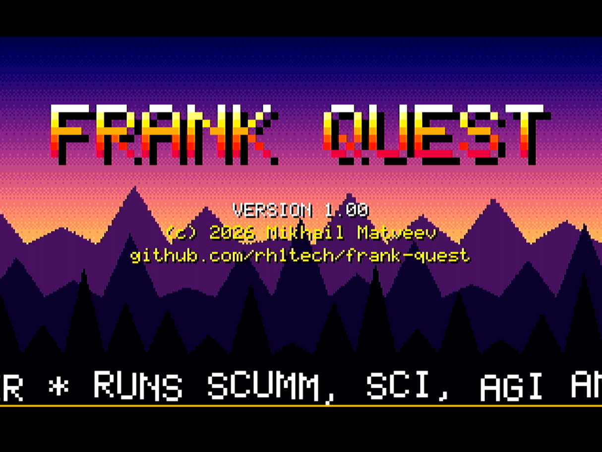
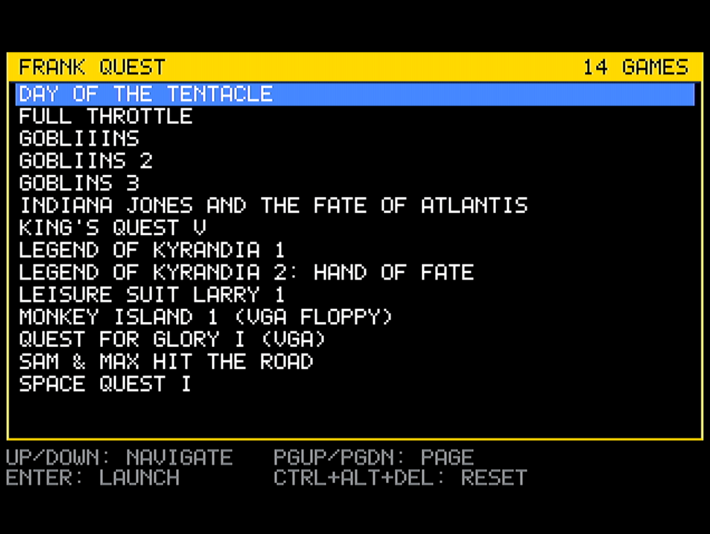
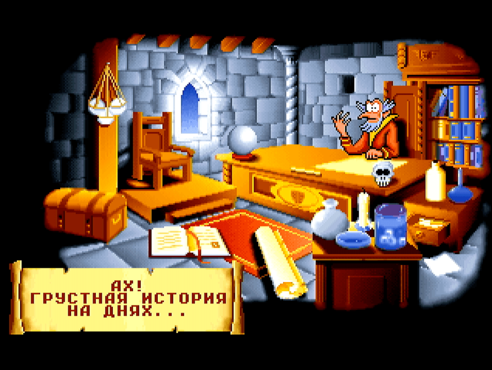
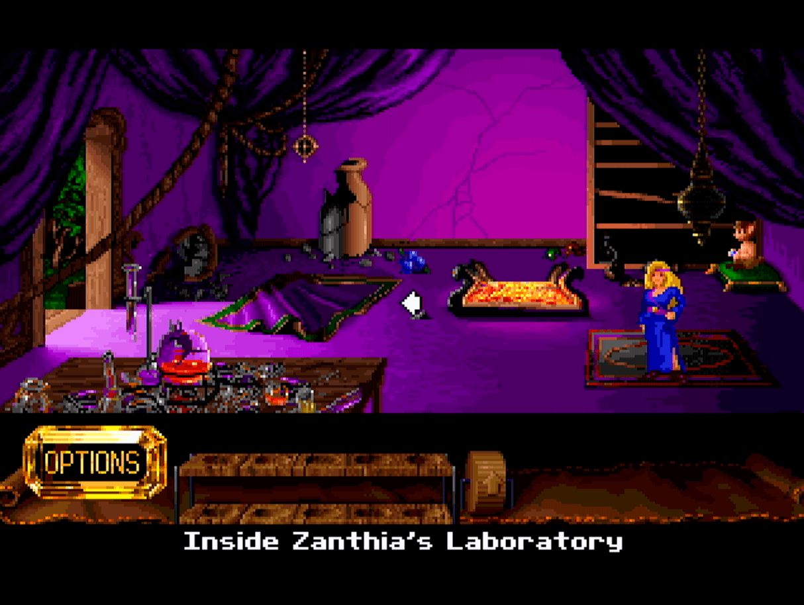
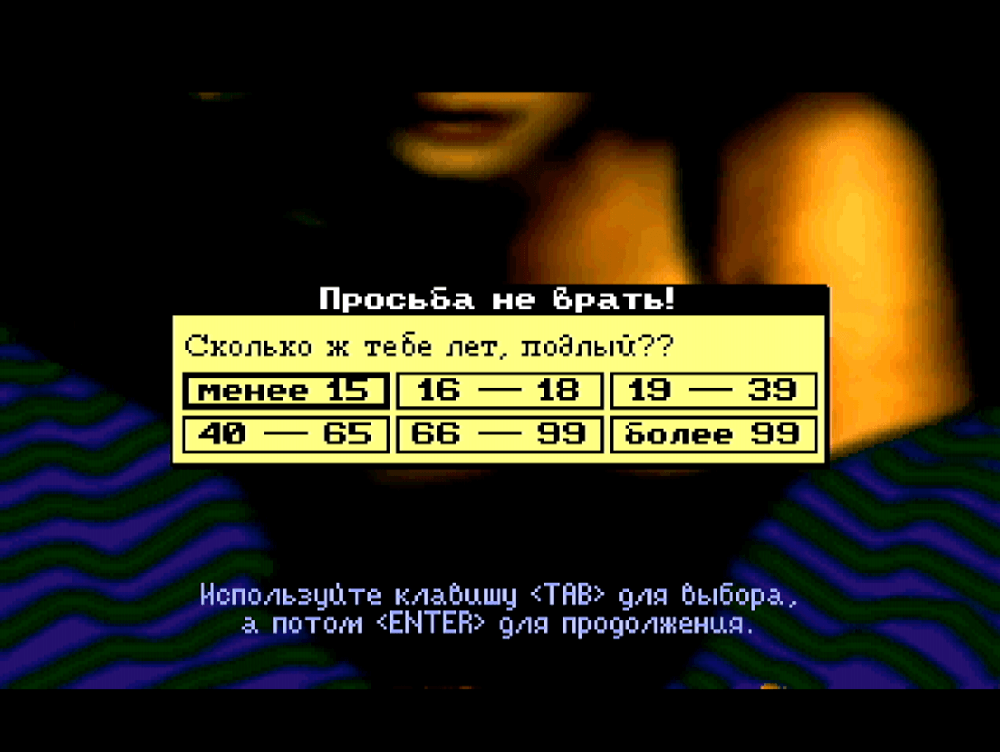
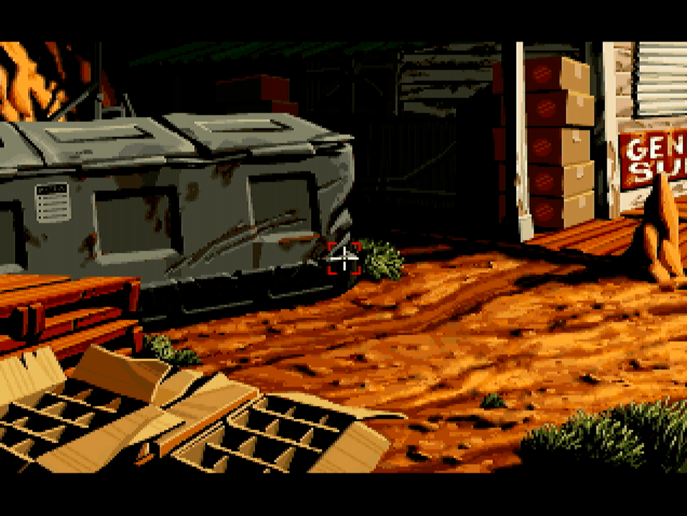
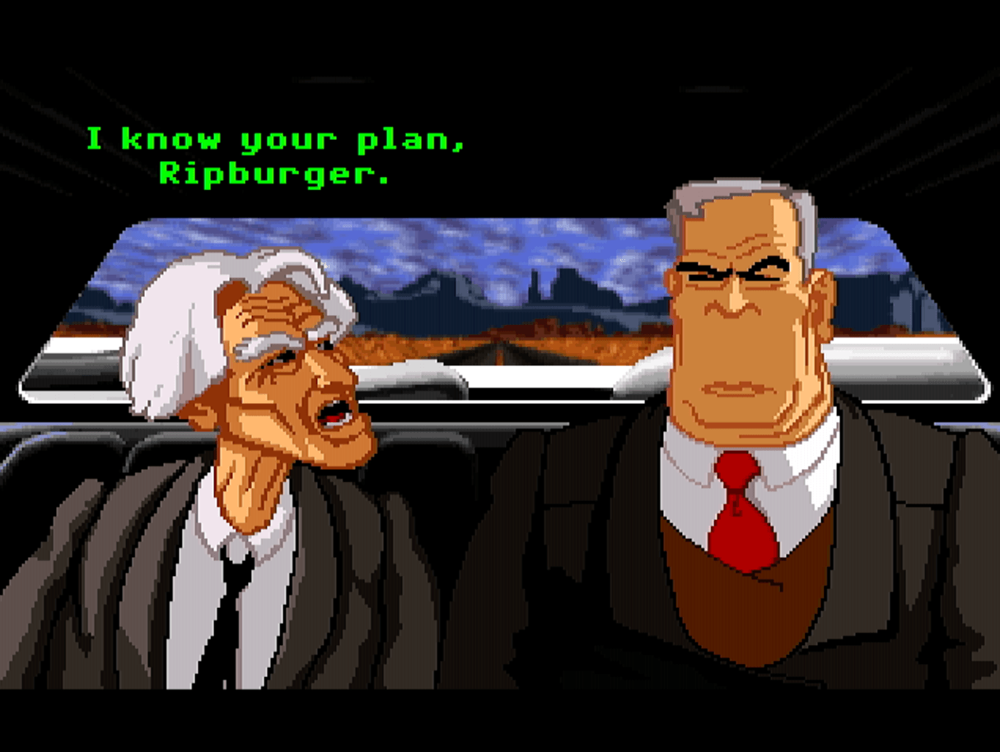

# FRANK Quest

Official page: **[frank.rh1.tech](https://frank.rh1.tech/)** — hub for all FRANK boards and firmware.

A ScummVM adventure-game engine running on the Raspberry Pi Pico 2 (RP2350). HSTX HDMI video, SD card game browser, I2S audio, PS/2 input, and optional USB HID input.

Derived from [Cabal](https://github.com/project-cabal/cabal), a community-maintained fork of [ScummVM](https://www.scummvm.org/) by Eugene Sandulenko, Max Horn, Travis Howell and many others.

## Screenshots

| | |
|---|---|
|  |  |
| Boot intro | SD card game selector |
|  |  |
| Gobliiins (GOB) | Legend of Kyrandia (KYRA) |
|  |  |
| Leisure Suit Larry (SCI) | Full Throttle (SCUMM v7) |
|  | |
| Full Throttle, action sequence | |

## Supported engines

| Engine  | Games |
|---------|-------|
| AGI     | Sierra AGI titles (King's Quest I–III, Space Quest I–II, Leisure Suit Larry I, Police Quest I, Manhunter, Mixed-Up Mother Goose, ...) |
| SCI     | Sierra SCI0 / SCI1 titles (King's Quest IV–VI, Space Quest III–V, Leisure Suit Larry II–V, Police Quest II–III, Quest for Glory I–III, ...) |
| SCUMM   | Lucasfilm SCUMM v1–v7 (Maniac Mansion, Zak McKracken, Indiana Jones and the Last Crusade, Loom, The Secret of Monkey Island, Monkey Island 2, Indiana Jones and the Fate of Atlantis, Day of the Tentacle, Sam & Max Hit the Road, Full Throttle) |
| GOB     | Coktel Vision games (Gobliiins, Gobliins 2, Goblins 3, Bargon Attack, Lost in Time, Ween, ...) |
| KYRA    | Westwood Studios Kyrandia 1 (Legend of Kyrandia) and Hand of Fate |

> SCUMM v7's Full Throttle works (iMUSE Digital + SMUSH). The Dig and Curse of Monkey Island (SCUMM v7/v8) are not yet built.

## Hardware platform

FRANK Quest targets the RP2350 with two board layouts:

| Variant | Hardware |
|---------|----------|
| M2      | [FRANK](https://rh1.tech/projects/frank?area=about) / [Murmulator 2.0](https://murmulator.ru) |
| M1      | Murmulator 1.x |

Pick the variant at build time:

```bash
./build.sh M2          # FRANK / Murmulator 2.0
./build.sh M1          # Murmulator 1.x
```

The active layout drives all GPIO assignments (HDMI, SD, PS/2, I2S, PSRAM CS) via `src/board_config.h`.

## Features

- HSTX HDMI video, 320×200 letterboxed to 320×240, double-buffered framebuffer in SRAM
- I2S and HDMI audio output paths (TDA1387 / PCM5102 over I2S, audio frames embedded in HDMI)
- SD card game browser
- ScummVM-compatible save/load on the SD card
- PS/2 keyboard and mouse on a single shared PIO program (`drivers/ps2/ps2.pio`)
- USB HID keyboard and mouse via TinyUSB host (`drivers/usbhid/`), with host-side typematic repeat
- PS/2 and USB HID can run at the same time
- Custom dlmalloc heap backed entirely by 8 MB external PSRAM
- 8 MB QSPI PSRAM auto-detected for both RP2350A (GPIO 8 / 19) and RP2350B (GPIO 47) packages
- Configurable CPU / PSRAM / Flash overclock at build time (504 / 133 / 66 MHz default)

## Hardware requirements

- Raspberry Pi Pico 2 (RP2350) or compatible RP2350A / RP2350B board
- 8 MB QSPI PSRAM (mandatory, see below)
- HDMI connector wired through 270 Ω resistors (the RP2350 drives HDMI directly via HSTX)
- SD card module (1-bit SD over PIO, see SD pin map)
- PS/2 keyboard and mouse (always available), and/or USB keyboard and mouse via the native USB port (built with the `usb-hid` flag)
- I2S DAC module (e.g. TDA1387, PCM5102) for line-level audio out

> USB HID and the USB serial console cannot coexist. With `usb-hid` enabled, the native USB port runs the host stack and debug logging is rerouted to UART.

### PSRAM is mandatory

ScummVM's runtime (heap-allocated game state, decoded resources, mixer ring buffers, font caches) does not fit in the RP2350's 520 KB of SRAM. FRANK Quest installs a custom dlmalloc backed entirely by external PSRAM (`drivers/psram_init.c`, `drivers/dlmalloc.c`). Without PSRAM the firmware will not boot.

Three ways to get a PSRAM-equipped board:

1. Solder a PSRAM chip on top of the flash chip of an RP2350 clone (SOP-8 flash chips are mostly only on clones, not the original Pico 2).
2. Build a [Nyx 2](https://rh1.tech/projects/nyx?area=nyx2), a DIY RP2350 board with integrated PSRAM.
3. Buy a [Pimoroni Pico Plus 2](https://shop.pimoroni.com/products/pimoroni-pico-plus-2?variant=42092668289107), a ready-made Pico 2 with 8 MB PSRAM.

## Pin assignment

> Both layouts are defined in `src/board_config.h`. SD pins are also exported through `drivers/sdcard/sdcard.h`.

| Subsystem     | Signal | M1 GPIO | M2 GPIO |
|---------------|--------|--------:|--------:|
| HDMI          | CLK−   | 6       | 12      |
|               | CLK+   | 7       | 13      |
|               | D0−    | 8       | 14      |
|               | D0+    | 9       | 15      |
|               | D1−    | 10      | 16      |
|               | D1+    | 11      | 17      |
|               | D2−    | 12      | 18      |
|               | D2+    | 13      | 19      |
| SD card       | CLK    | 2       | 6       |
|               | CMD    | 3       | 7       |
|               | D0     | 4       | 4       |
|               | D3     | 5       | 5       |
| PS/2 keyboard | CLK    | 0       | 2       |
|               | DATA   | 1       | 3       |
| PS/2 mouse    | CLK    | 14      | 0       |
|               | DATA   | 15      | 1       |
| I2S audio     | DATA   | 26      | 9       |
|               | BCLK   | 27      | 10      |
|               | LRCLK  | 28      | 11      |

### PSRAM (auto-detected)

| Chip Package | CS GPIO |
|--------------|---------|
| RP2350B      | 47      |
| RP2350A (M1) | 19      |
| RP2350A (M2) | 8       |

## How to use

### SD card setup

1. Format an SD card as FAT32.
2. Create a top-level directory called `quest`.
3. Copy each game's data files into a subdirectory of `quest/`. The subdirectory name has to match one of the names below, otherwise the selector won't pick it up.
4. Insert the SD card and power on the device.

### Game directory names

The selector matches each `quest/<dir>` against the table below. The first matching entry wins, so when there are several aliases for the same game, the first one is the canonical pick. Names are case-insensitive.

#### SCUMM (LucasArts)

| Directory     | Game                                          | Notes |
|---------------|-----------------------------------------------|-------|
| `mi1`         | Monkey Island 1 (VGA floppy)                  | needs `000.LFL` |
| `mi1ega`      | Monkey Island 1 (EGA floppy)                  | needs `000.LFL` |
| `loom`        | Loom (VGA)                                    | needs `000.LFL` |
| `mi1cd` or `monkey` | Monkey Island 1 (CD talkie)             | needs `monkey.000` |
| `mi2` or `monkey2` | Monkey Island 2: LeChuck's Revenge       | needs `monkey2.000` |
| `atlantis` or `indy4` | Indiana Jones and the Fate of Atlantis | needs `atlantis.000` |
| `dott` or `tentacle` | Day of the Tentacle                    | needs `tentacle.000` |
| `samnmax` or `sam` | Sam & Max Hit the Road                   |       |
| `ft` or `fulltp` | Full Throttle                              | needs `ft.la0` |

#### SCI (Sierra SCI0 / SCI1)

| Directory      | Game                                |
|----------------|-------------------------------------|
| `kq1`          | King's Quest I                      |
| `kq4`          | King's Quest IV                     |
| `kq5`          | King's Quest V                      |
| `kq6`          | King's Quest VI                     |
| `lsl1`         | Leisure Suit Larry 1                |
| `lsl2`         | Leisure Suit Larry 2                |
| `lsl3`         | Leisure Suit Larry 3                |
| `lsl5`         | Leisure Suit Larry 5                |
| `lsl6`         | Leisure Suit Larry 6                |
| `sq1`          | Space Quest I                       |
| `sq3`          | Space Quest III                     |
| `sq4`          | Space Quest IV                      |
| `sq5`          | Space Quest V                       |
| `pq1`          | Police Quest I                      |
| `pq2`          | Police Quest II                     |
| `pq3`          | Police Quest III                    |
| `qfg1` / `qfg1vga` | Quest for Glory I (EGA / VGA)   |
| `qfg2`         | Quest for Glory II                  |
| `qfg3`         | Quest for Glory III                 |
| `iceman`       | Codename: ICEMAN                    |
| `laurabow`     | Laura Bow: Colonel's Bequest        |
| `laurabow2`    | Laura Bow 2: Dagger of Amon Ra      |
| `longbow`      | Conquests of the Longbow            |
| `ecoquest`     | EcoQuest                            |
| `ecoquest2`    | EcoQuest 2                          |
| `freddy`       | Freddy Pharkas                      |
| `jones`        | Jones in the Fast Lane              |
| `pepper`       | Pepper's Adventures in Time         |
| `slater`       | Slater & Charlie Go Camping         |
| `castlebrain`  | Castle of Dr. Brain                 |
| `islandbrain`  | Island of Dr. Brain                 |
| `mothergoose`  | Mixed-Up Mother Goose               |
| `camelot`      | Conquests of Camelot                |

#### KYRA (Westwood)

| Directory                                  | Game                                   |
|--------------------------------------------|----------------------------------------|
| `kyra1` / `kyr1` / `kyrandia`              | Legend of Kyrandia 1                   |
| `kyra2` / `kyr2` / `kyrandia2` / `handoffate` | Legend of Kyrandia 2: Hand of Fate  |

#### GOB (Coktel Vision)

| Directory   | Game                               |
|-------------|------------------------------------|
| `gob1`      | Gobliiins                          |
| `gob2`      | Gobliins 2                         |
| `gob3`      | Goblins 3                          |
| `gob`       | Gobliiins (auto-detect)            |

#### AGI (pre-SCI Sierra)

| Directory | Game                          |
|-----------|-------------------------------|
| `agi`     | Generic / fan-made AGI title  |

> **Probe files matter.** SCUMM detectors check for a specific resource file in the directory (`000.LFL`, `monkey.000`, `tentacle.000`, etc). If you renamed or split the game's data files, the selector skips the directory.

Example layout:

```
SD:/
└── quest/
    ├── monkey/        ← MI1 CD talkie
    │   ├── monkey.000
    │   └── monkey.001
    ├── dott/          ← Day of the Tentacle
    │   ├── tentacle.000
    │   └── ...
    ├── kq6/           ← King's Quest VI
    │   ├── resource.000
    │   ├── resource.map
    │   └── ...
    └── kyra1/         ← Legend of Kyrandia 1
        ├── kyra.dat
        └── ...
```

### Boot flow

1. **Welcome screen.** Short intro with logo, version, ticker, and sinescroll. Any keypress or mouse-button press skips it.
2. **Selector.** Animated list of detected games on the SD card. Cursor keys or mouse to choose, **Enter** or click to launch.
3. **Game.** The chosen ScummVM engine runs, the same way it would on a desktop.

The selector enumerates `/quest/*` lazily, with no preloading and no global manifest.

### In-game

| Key                  | Action |
|----------------------|--------|
| Cursor keys / mouse  | Game input (engine-specific) |
| Esc                  | Skip dialogue / cutscene |
| Space                | Pause |
| Ctrl+Alt+Del         | Quit current game and return to selector |

Bindings follow upstream ScummVM defaults; some engines ignore individual keys.

## Building

### Prerequisites

1. Install the [Raspberry Pi Pico SDK](https://github.com/raspberrypi/pico-sdk) (version 2.0+).
2. `export PICO_SDK_PATH=/path/to/pico-sdk`.
3. Install the ARM GCC toolchain (`arm-none-eabi-gcc`).
4. Install `cmake` and `picotool`.

### Build

```bash
git clone https://github.com/rh1tech/frank-quest.git
cd frank-quest
./build.sh                       # M2, 504 / 133 / 66 MHz, PS/2 input
./build.sh M1                    # Murmulator 1.x layout
./build.sh M2 504 133 66 usb-hid # M2 with USB HID keyboard / mouse
./build.sh M2 252 100 50         # Conservative timings
./build.sh M1 clean              # Wipe build dir first
```

Output: `build/frank-quest.uf2` and `build/frank-quest.elf`.

### Build options

`build.sh [BOARD] [CPU_MHZ] [PSRAM_MHZ] [FLASH_MHZ] [usb-hid] [clean]`

| Slot         | Values                          | Default | Notes |
|--------------|---------------------------------|---------|-------|
| `BOARD`      | `M1`, `M2`                      | `M2`    | Pin layout |
| `CPU_MHZ`    | `252`, `378`, `504`             | `504`   | Auto-selects core voltage (1.50 / 1.60 / 1.65 V) |
| `PSRAM_MHZ`  | `84`, `100`, `133`, `166`       | `133`   | QMI PSRAM bus cap |
| `FLASH_MHZ`  | any MHz value                   | `66`    | QMI flash bus cap |
| `usb-hid`    | flag                            | off     | USB HID keyboard / mouse, UART for console |
| `clean`      | flag                            | off     | `rm -rf ./build` before configure |

### Release builds

```bash
./release.sh           # prompts for version
./release.sh 1.00      # non-interactive
```

Output goes to `releases/m1p2_frank-quest_<MAJOR>_<MINOR>.uf2` and `releases/m2p2_frank-quest_<MAJOR>_<MINOR>.uf2`. Both ship with USB HID enabled, at 504 / 100 / 66 MHz by default. Override with `RELEASE_CPU_SPEED`, `RELEASE_PSRAM_SPEED`, `RELEASE_FLASH_SPEED`.

### Flashing

```bash
# With the device in BOOTSEL mode:
./flash.sh

# Or manually:
picotool load -f build/frank-quest.uf2
picotool reboot -f
```

## Troubleshooting

### Device won't boot / blank HDMI

- Check the board has 8 MB PSRAM and the right CS pin (GPIO 47 for RP2350B, 8 / 19 for RP2350A).
- Check HDMI is wired through 270 Ω resistors on the correct GPIOs for the chosen variant.
- Drop CPU and PSRAM speeds: `./build.sh M2 252 100 50`. PSRAM at 166 MHz is corner-case sensitive to wiring.

### USB HID keyboard / mouse not detected

- Re-flash with `usb-hid`: `./build.sh M2 504 133 66 usb-hid`.
- USB HID and USB serial cannot coexist. Debug output goes to UART (115200 baud) when USB HID is enabled.
- Some hubs and "smart" keyboards have report descriptors that need extra parsing. The generic descriptor parser is in `drivers/usbhid/hid_app.c`.

### A game doesn't appear in the selector

- The directory name has to match the table in [Game directory names](#game-directory-names) above.
- For SCUMM titles, the listed probe file (`000.LFL`, `monkey.000`, `tentacle.000`, ...) has to be present and readable.
- Check the UART or USB serial log on boot, the selector logs each scanned directory.

### Slow boot or game scan

- Keep `quest/` reasonable. The selector enumerates the SD card on every boot and probes every subdirectory.

## License

Copyright © 2026 Mikhail Matveev <<xtreme@rh1.tech>>

Code authored for FRANK Quest is licensed under the GNU General Public License, version 3 or later (GPL-3.0-or-later). See [LICENSE](LICENSE).

The bulk of `src/` and parts of `drivers/sdcard/` come from upstream Cabal (a fork of ScummVM) and stay under their original ScummVM license terms: primarily GPL-2.0-or-later, with LGPL-2.1-or-later, BSD, and GPLv3-with-font-exception parts as noted per file. The upstream license texts are kept verbatim:

| File                                  | What it covers |
|---------------------------------------|----------------|
| [COPYING](COPYING)                    | GNU GPL v2, primary ScummVM / Cabal license |
| [COPYING.LGPL](COPYING.LGPL)          | GNU LGPL v2.1, selected ScummVM components |
| [COPYING.BSD](COPYING.BSD)            | BSD-style, selected ScummVM components (e.g. NDS port, MPEG decoder) |
| [COPYING.FREEFONT](COPYING.FREEFONT)  | GNU GPL v3 with font embedding exception, bundled GNU FreeFont |
| [COPYRIGHT](COPYRIGHT)                | Cabal / ScummVM contributor list |

Each source file carries an SPDX identifier in its header. When in doubt, the file header is authoritative. The root `LICENSE` covers original FRANK Quest code only; upstream code keeps its original ScummVM-derived terms.

Selected non-Cabal third-party components carry their own headers:

| Component                            | Path                          | License |
|--------------------------------------|-------------------------------|---------|
| dlmalloc (Doug Lea)                  | `drivers/dlmalloc.c`          | Public domain (CC0) |
| pico_fatfs SD card / PIO SPI         | `drivers/sdcard/`             | BSD-2-Clause (Elehobica) |
| `Ps2Kbd_Mrmltr` (PS/2 PIO driver)    | `drivers/ps2/kbd/`            | GPL-2.0-or-later (mrmltr) |
| TinyUSB HID host glue                | `drivers/usbhid/hid_app.c`    | MIT (TinyUSB), see file header |

## Acknowledgments

| Project | Author(s) | License | Used for |
|---------|-----------|---------|----------|
| [Cabal](https://github.com/project-cabal/cabal) | Project Cabal contributors | GPL-2.0-or-later | Engine code (AGI, SCI, SCUMM, GOB, KYRA) and ScummVM common runtime |
| [ScummVM](https://www.scummvm.org/) | The ScummVM team | GPL-2.0-or-later | Upstream of Cabal: adventure-game engines, common runtime, GUI |
| [Raspberry Pi Pico SDK](https://github.com/raspberrypi/pico-sdk) | Raspberry Pi Foundation | BSD-3-Clause | HAL, HSTX, PIO, DMA, multicore |
| [TinyUSB](https://github.com/hathach/tinyusb) | Ha Thach | MIT | USB HID host driver |
| [pico_fatfs](https://github.com/elehobica/pico_fatfs_test) | Elehobica | BSD-2-Clause | SD card PIO-SPI driver |
| [FatFs](http://elm-chan.org/fsw/ff/) | ChaN | Custom permissive | FAT32 filesystem |
| [dlmalloc](http://gee.cs.oswego.edu/dl/html/malloc.html) | Doug Lea | Public domain | PSRAM heap allocator |

Special thanks to:

- The Cabal maintainers for keeping ScummVM's pre-1.x engines portable.
- Eugene Sandulenko, Max Horn, Travis Howell, and the wider ScummVM team for two decades of adventure-game preservation.
- DnCraptor and the Murmulator community for the M1 / M2 hardware reference designs.
- The Raspberry Pi Foundation for the RP2350 and Pico SDK.
- Sierra On-Line and LucasArts for the original games.

## Author

Mikhail Matveev <<xtreme@rh1.tech>>

[https://rh1.tech](https://rh1.tech) | [GitHub](https://github.com/rh1tech/frank-quest)
